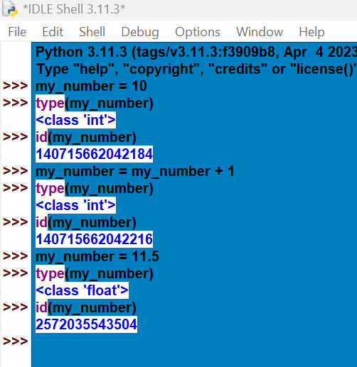
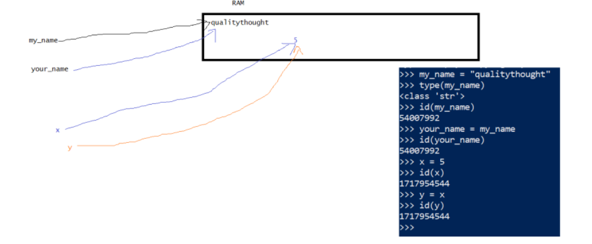
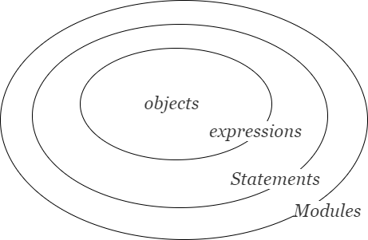
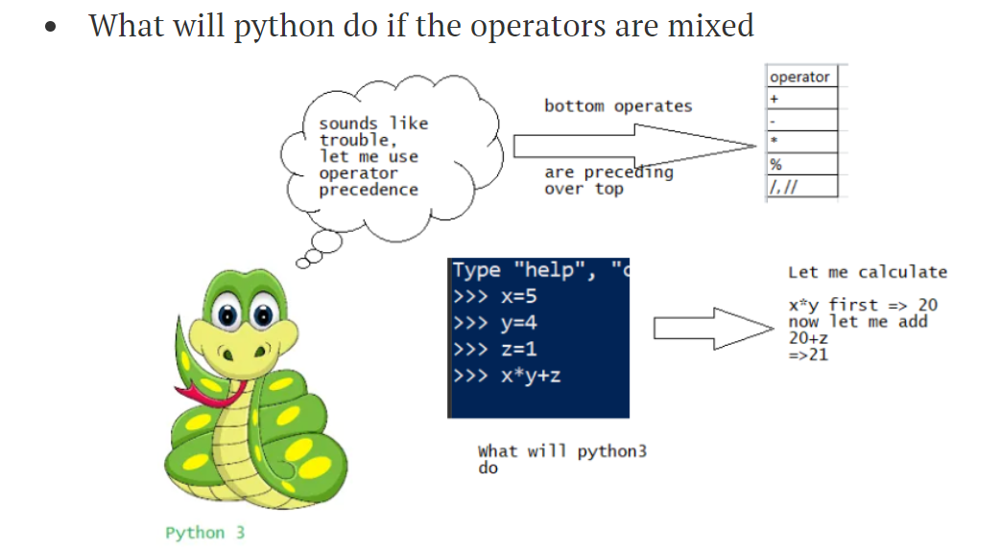
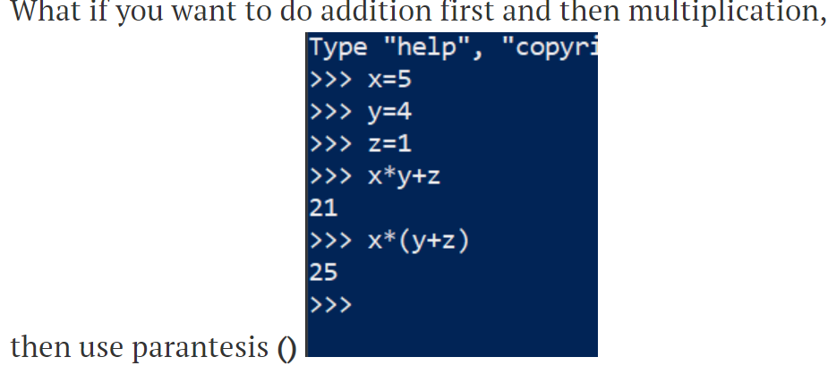
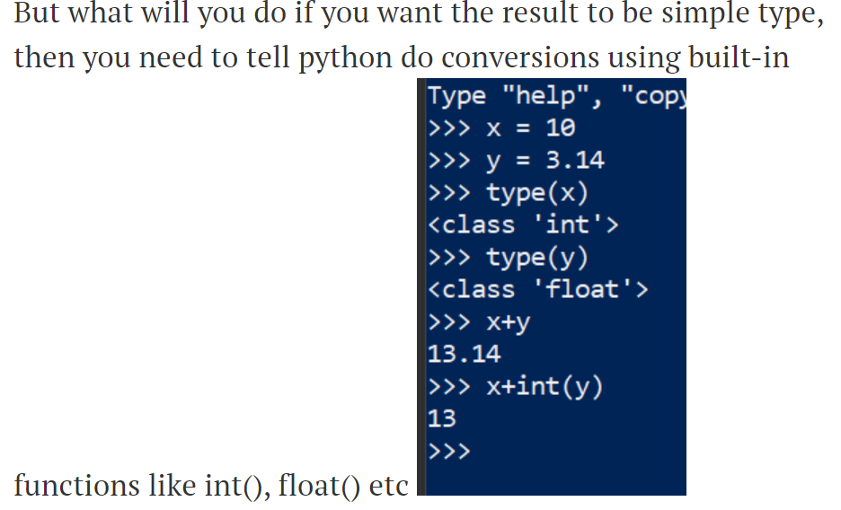
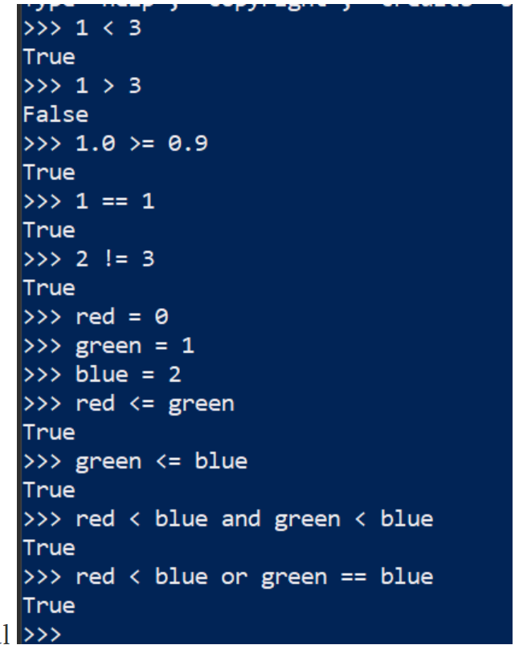
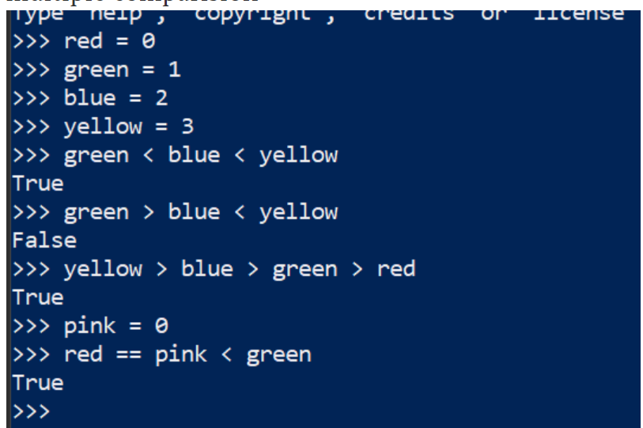
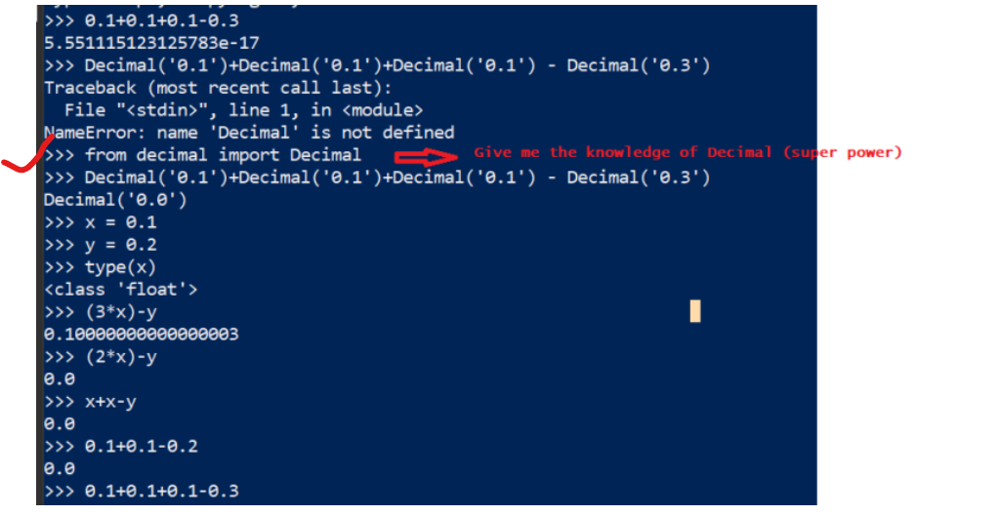

# 20-jul-2020

## 1. Compiler and Interpreter

### Compiler
    - C-program

### Interpreter
    - Java program - JVM
    - Python program - PVM

## 2. Memory Allocations and Memory Leaks

### Memory Allocation
 
    - DataTypes
        - mutable datatypes
        - Immutable datatypes

### Memory Leaks
    - Garbage Collectors

# 21-jul-2020

## 3. Python Interpreter
    
    - Programmer's View
    - Python's view

## 4. Bytecode Compilation

    source code -> Byte code -> PVM
    hello.py    -> hello.pyc -> PVM

## 5. Python Implimentations

    - CPython
    - Jython
    - IronPython
    - PyPy
    - PYJION
    - Anaconda and Miniconda
    - NUTICA
    - GRUMPY

## 6. Python Development and Versions

   ### [Refer](https://www.python.org/psf-landing/)
   ### [Refer](https://peps.python.org/)
   ### [Zyne of Python](https://peps.python.org/pep-0020/)
   ### [Style Guide](https://peps.python.org/pep-0008/)

## 7. Python Installations
    - Using choclaty

# 24-jul-2020

## 8. Built-in functions
    - type()
    - id()

## 9. Assignment of variables
#### Note: When we are assigning variable values to other variables both will be pointing out to same memory location.

# 25-jul-2020

## 10. Python Conceptual Hiererchy
    

## 11. Python's core data types (Built-in-Objects)

    - Numbers
    - Strings
    - List
    - Tuples
    - Dictionaries
    - Files
    - Sets
    - Boolean
    - None
    - Functions, Modules, classes
    - Compiled code, Stack tracebacks

## 12. Operators

    - +,*, /, %, ==, != 

## 13. Data types for handeling numeric types

    - Integrer and floating point Objects
    - Complex Number Objects
    - Decimal Objects
    - Fractional
    - Sets

# 27-jul-2020

## 14. Built-in mathematical operators:

    - pow, abs, round, int, hex, bin

## 15. Operator Precedence

#### *Use Paratesis() -> addition first and then mltiplication

## 16. Mixed Types are converted up

    - use of int(), float()

##

# 28-jul-2020

## 17. Comparisions

    - operators < > <= >= == !=

### Normal Comparision

### Chained Comparision

## 18. Integer Precisions
    - python supports integers of unlimited size

## 19. Decimal Precisions

## 20. Built-in Numeric tools
    - import math
    - math.pow()
    - math.sqrt()
    - min()
    - max()
    - round()
    - import random
    - random.random()
    - random.randint(1,100)

## 21. Understanding list

         

   

